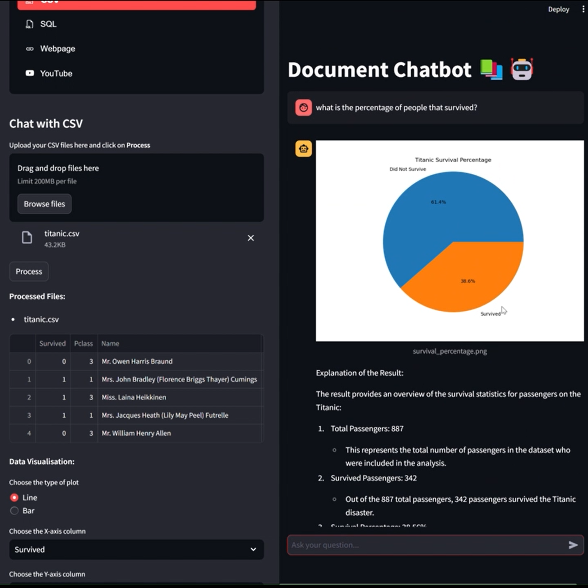

# Document Chatbot 📚🤖

Generative AI chatbot application for querying and interacting with documents in various formats using LLMs with RAG (retrieval augmented generation) pipeline. The app allows users to ask questions about context from PDF, CSV, SQL databases, webpages, and YouTube videos. It includes advanced functionalities like conversational memory storing the history of messages, vector databases to store embeddings from the document context. There also is the option to switch between various LLMs including from OpenAI GPT, Anthropic Claude, Google Gemini, Cohere and Meta Llama via Groq. 

**Demo:** [Click Here](https://www.youtube.com/watch?v=USZHfCcRATA)

## Features

1. **PDF Mode**
   - Users can upload multiple PDF files for processing by extracting the text and splitting into chunks to be store into the vector database.
   - Retrieves context from the PDFs to be used in the prompt for answering questions.
   - Includes references to relevant pages with confidence scores based on similarity with the context from the vector embeddings.

2. **CSV Mode**
   - Users can upload CSV files to be processed into DataFrames for querying.
   - Execute Python code to help answer questions that require mathematical calculations and data transformations.
   - Generate visualizations about the data based on user queries with automatic graph creation and display.

3. **SQL Mode**
   - Connects to MySQL databases using provided credentials (username, password, host, port, and database name).
   - Generates SQL queries based on user prompts and executes them referring to the connected database.
   - Provides natural language answers based on query results with details of the SQL query and data retrieved.

4. **Webpage Mode**
   - Toggle option to get responses from automatically searching the web or manually input URLs to retrieve content from webpages.
      - Web browsing tool converts prompt into search query and retreives content from sources then uses the llm to summarize an answer with the sources.
      - The information from the manually entered URLs are extracted and stored into vector database for retrieval. 
      - The agent has access to retreive content from the vector database or use the web browser to generate answers. 

5. **YouTube Mode**
   - Users can input YouTube video URLs then extracts the text from the transcription to be stored into the vector database. 
   - Provides summary from the transcription of the video. 
   - Retrieves relevent content from the vector database based on the video transcription to generate accrurate answers. 

## Tech Stack
- **LangChain**: Provides chain components for RAG and agents using document processing for vector databases, along with conversational memory and prompt templates for accurate and robust responses relevant to the context of the documents.
- **Streamlit**: UI framework for the interactive chatbot experiences.
- **Chroma / Pinecone**: Vector databases for efficient document embedding and retrieval.
- **Pandas**: Utilized for data manipulation and analysis of structured datasets.
- **Matplotlib**: Generating data visualizations in response to queries about structured datasets.

**Run Application CMD:** `streamlit run app.py`

## Screenshots

